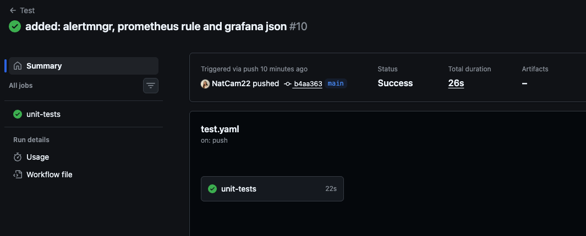
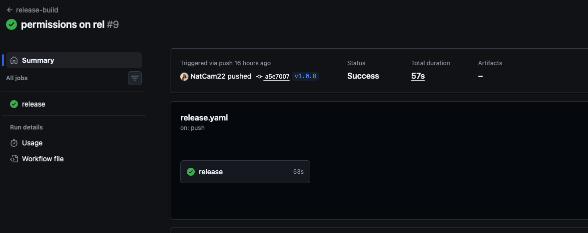
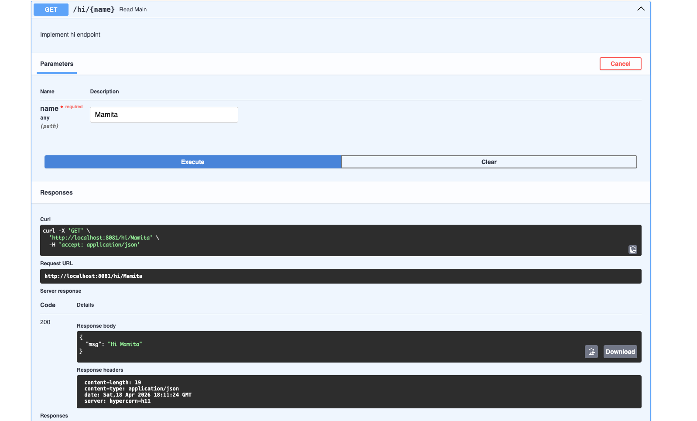
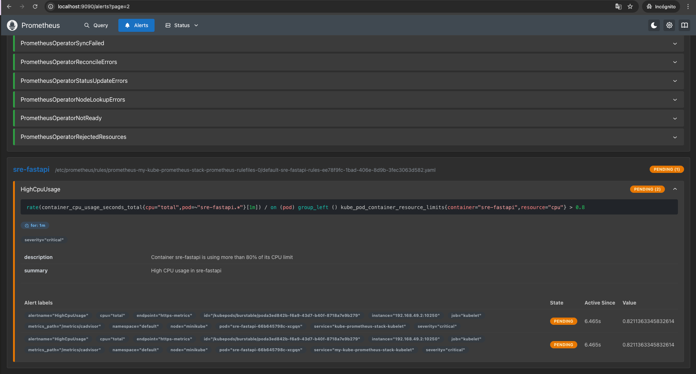
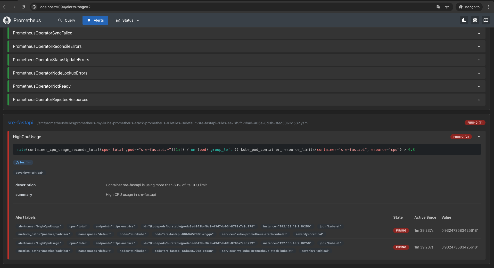
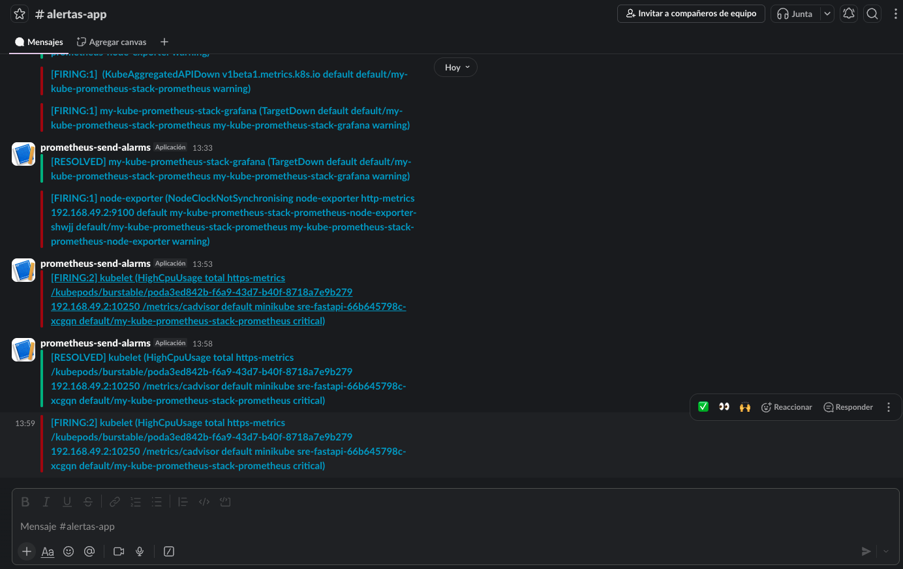
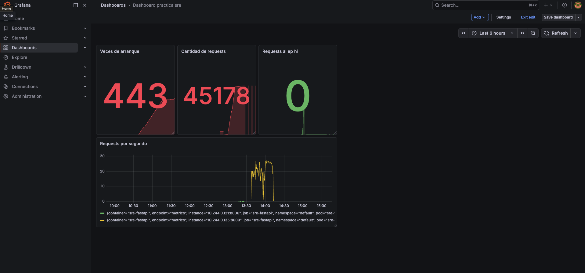

# SRE FastAPI — Práctica Final
Repositorio para la práctica del módulo SRE - devops 13
Pipeline de CI/CD, monitorización con Prometheus, alertas con Alertmanager y dashboard con Grafana para una aplicación FastAPI desplegada en Kubernetes.

---

## Descripción

Aplicación FastAPI con tres endpoints:

| Endpoint | Respuesta | Métrica |
|---|---|---|
| `GET /` | `{"msg": "Hello World"}` | `main_requests_total` |
| `GET /health` | `{"health": "ok"}` | `healthcheck_requests_total` |
| `GET /hi/{name}` | `{"msg": "Hi {name}"}` | `hi_requests_total` |

Todas las llamadas incrementan también `server_requests_total`.

La app expone métricas de Prometheus en el puerto `8000` y la API en el puerto `8081`.

El request añadido: /hi/{name} retorna un json {"msg": "hi name"}
---

##  Estructura del Proyecto

```
SRE-devops-xiii/
├── src/
│   ├── application/
│   │   ├── __init__.py
│   │   └── app.py           # Endpoints + contadores Prometheus
│   ├── tests/
│   │   └── app_test.py      # Tests unitarios
│   └── app.py               # Entry point
├── helm/
│   └── sre-fastapi/
│       ├── Chart.yaml
│       ├── values.yaml
│       └── templates/
│           ├── deployment.yaml
│           ├── service.yaml
│           └── servicemonitor.yaml
├── k8s/
│   └── prometheus-rules.yaml  # Regla de alerta CPU
├── .github/
│   └── workflows/
│       ├── test.yaml          # CI: tests en cada push
│       └── release.yaml       # CD: build y push en cada tag
├── alertmanager-values.yaml   # Configuración Alertmanager + Slack
├── grafana-dashboard.json     # Dashboard exportado
├── Makefile
├── Dockerfile
└── requirements.txt
```

---

##  Tests

Los tests están en `src/tests/app_test.py` y cubren los tres endpoints.

```bash
# Crear virtualenv
python3 -m venv venv
source venv/bin/activate
pip install -r requirements.txt

# Correr tests
pytest

# Tests con cobertura
pytest --cov
```

---

##  Ejecución local

```bash
# Directamente con Python
source venv/bin/activate
python3 src/app.py

# Con Docker
docker build -t sre-fastapi .
docker run -p 8081:8081 -p 8000:8000 sre-fastapi
```

La app queda disponible en:
- API: `http://localhost:8081`
- Métricas: `http://localhost:8000`

---

##  CI/CD con GitHub Actions

### `test.yaml`
Se dispara en cada push a cualquier rama. Ejecuta los tests con cobertura.

### `release.yaml`
Se dispara cuando se hace push de un tag con formato `v*`:

```bash
git tag v1.0.0
git push origin v1.0.0
```

Construye la imagen Docker y la publica en GHCR:
```
ghcr.io/natcam22/sre-practica-devops-xiii:1.0.0
ghcr.io/natcam22/sre-practica-devops-xiii:latest
```
Se puede evidenciar que ya se construyó y pusheó correctamente la imagen en versiones anteriores en el aartado de packages del repositorio en github.
---

##  Despliegue en Kubernetes

### Requisitos
- Minikube
- Helm

### Levantar Minikube

```bash
minikube start
minikube addons enable ingress
minikube addons enable metrics-server
```

### Desplegar la app con Helm

```bash
helm install sre-fastapi helm/sre-fastapi/ --values helm/sre-fastapi/values.yaml
```

### Verificar

```bash
kubectl get pods -l app=sre-fastapi
kubectl top pod -l app=sre-fastapi
```

### Acceder a la app

```bash
kubectl port-forward svc/sre-fastapi 8081:8081
curl http://localhost:8081/health
curl http://localhost:8081/hi/natalia
```

---

##  Monitorización con Prometheus

### Instalar kube-prometheus-stack

```bash
helm repo add prometheus-community https://prometheus-community.github.io/helm-charts
helm repo update

helm install my-kube-prometheus-stack prometheus-community/kube-prometheus-stack 
```

### Acceder a Prometheus

```bash
kubectl port-forward svc/my-kube-prometheus-stack-prometheus 9090:9090
```

Abre `http://localhost:9090`

### ServiceMonitor

El Helm chart de la app incluye un `ServiceMonitor` que configura Prometheus para scrapeear las métricas en el puerto `8000` cada 15 segundos. Se puede verificar en Prometheus → **Status** → **Targets** buscando `sre-fastapi`.

### Métricas disponibles

```promql
# Total de requests al servidor
sum(server_requests_total)

# Requests por segundo
rate(server_requests_total[1m])

# Requests al endpoint /hi
sum(hi_requests_total)

# Reinicios del contenedor
sum(kube_pod_container_status_restarts_total{container="sre-fastapi"})
```

---

##  Alertas

### Regla de CPU

La alerta `HighCpuUsage` se dispara cuando el contenedor `sre-fastapi` supera el 80% de su límite de CPU durante más de 1 minuto:

```bash
kubectl apply -f k8s/prometheus-rules.yaml
```

| Campo | Valor |
|---|---|
| Severidad | `critical` |
| Condición | CPU > 80% del límite |
| `for` | 1 minuto |

### Prueba de estrés

Para disparar la alerta manualmente:

```bash
kubectl run stress-test --image=busybox --restart=Never -- sh -c \
  "while true; do wget -q -O- http://sre-fastapi:8081/; done"
```

Para detenerlo:

```bash
kubectl delete pod stress-test
```

---

## 📢 Alertmanager + Slack

Las alertas con `severity: critical` se envían al canal `#alertas-app` en Slack.

### Configurar

Edita `alertmanager-values.yaml` con tu webhook de Slack y aplica:

```bash
helm upgrade my-kube-prometheus-stack prometheus-community/kube-prometheus-stack \
  --values alertmanager-values.yaml
```

### Acceder a Alertmanager

```bash
kubectl port-forward svc/my-kube-prometheus-stack-alertmanager 9093:9093
```

Abre `http://localhost:9093`

---

## 📈 Dashboard de Grafana

### Acceder

```bash
kubectl port-forward svc/my-kube-prometheus-stack-grafana 3000:80
```

Abre `http://localhost:3000` → usuario `admin`, contraseña: se debe solicitar utilizando el comando que aparece al instalar el helm:
`kubectl --namespace default get secrets my-kube-prometheus-stack-grafana -o jsonpath="{.data.admin-password}" | base64 -d ; echo`
(se debe editar de acuerdo al namespace, yo sí usé el default)

### Importar el dashboard

1. **Dashboards** → **New** → **Import**
2. Sube el archivo `grafana-dashboard.json`

### Paneles incluidos

| Panel | Query | Tipo |
|---|---|---|
| Veces de arranque | `sum(kube_pod_container_status_restarts_total{container="sre-fastapi"})` | Stat |
| Total requests | `sum(server_requests_total)` | Stat |
| Requests al endpoint /hi | `sum(hi_requests_total)` | Stat |
| Requests por segundo | `rate(server_requests_total[1m])` | Time series |

---

## 📸 Screenshots
- Pipeline de GitHub Actions

 
 

- Fastapi nuevo endpoint

 
- Alerta nueva regla: HighCpuUsage en Pending y luego Firing

 
 
- Mensaje en Slack

 
- Dashboard de Grafana

 